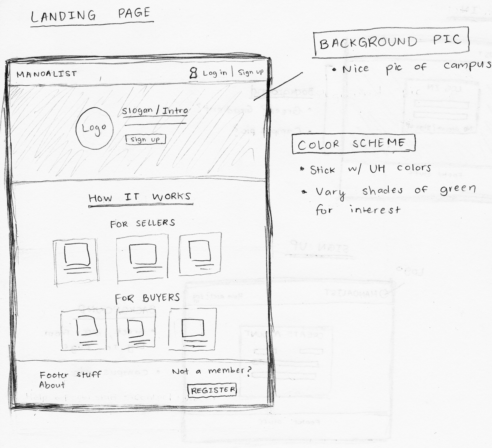
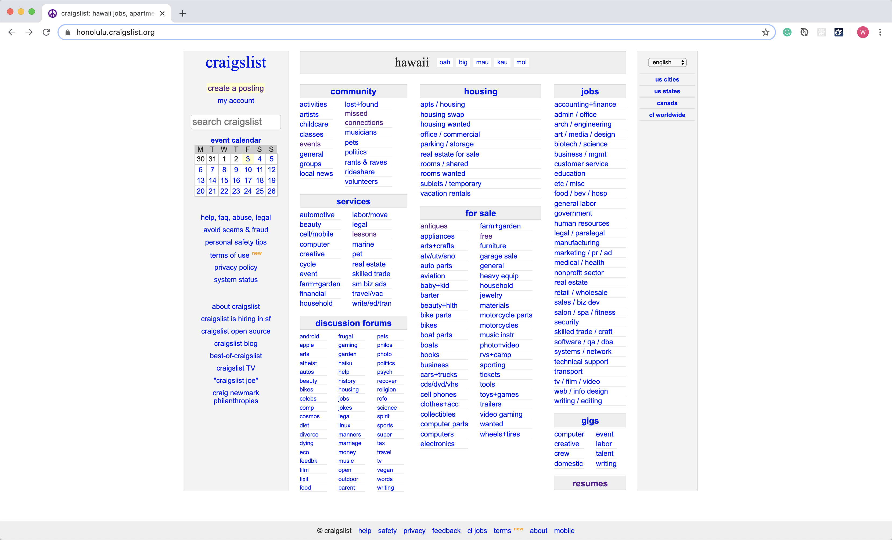

# Manoalist
This project is to build an an application for UHM students to facilitate buying and selling of student-related goods and service. Our goal is to work as a team and develop a nice website call "Manoalist".

Manoalist allows user to:

- Register a account
- Login to view the items for sell
- Post for sell item information
- Rate seller after purchase

## User Interface Walkthrough

### landing page

When you first bring up the application, you will see the landing page that provides a brief introduction to manoalist. So sellers and buyers can read to know how this application works.

.....

1. Build a home page
2. create M1 Project Board and list issues on it
3. prepare presentation
4. deploy project to galaxy
......

We can build something like this and we can make the UI looks nicer.
