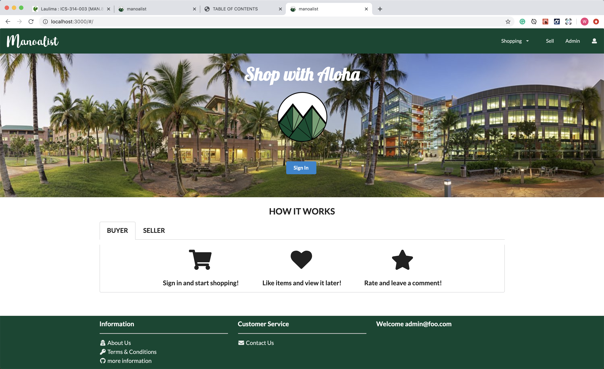
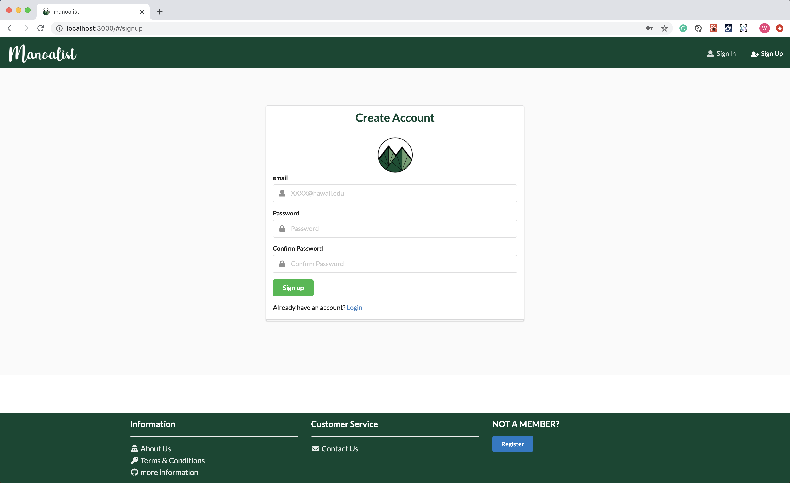
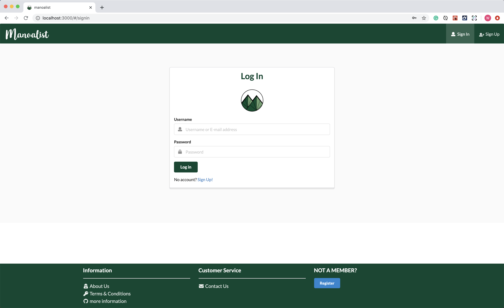
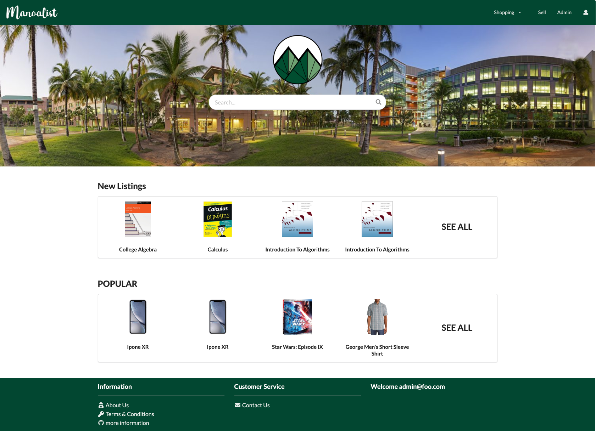
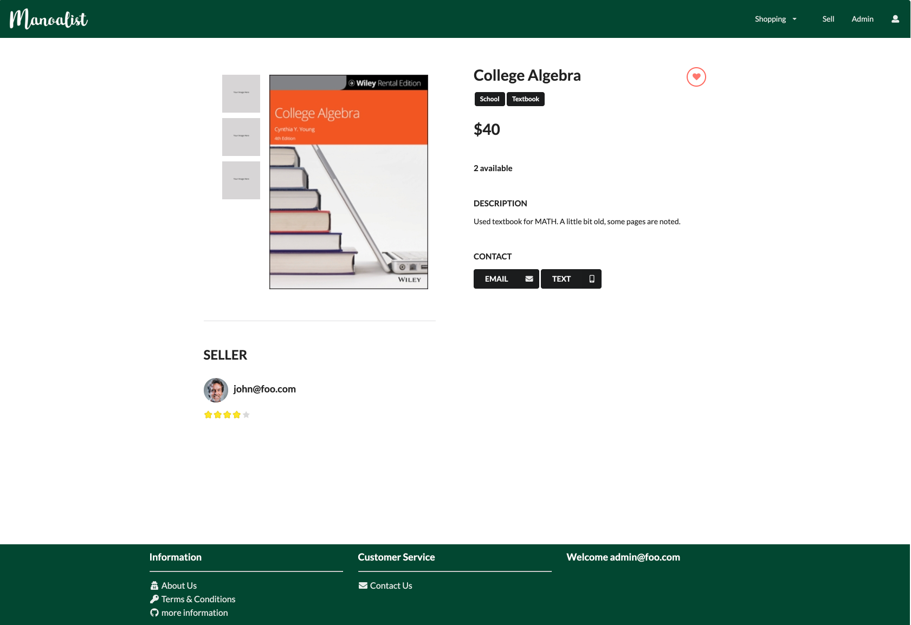
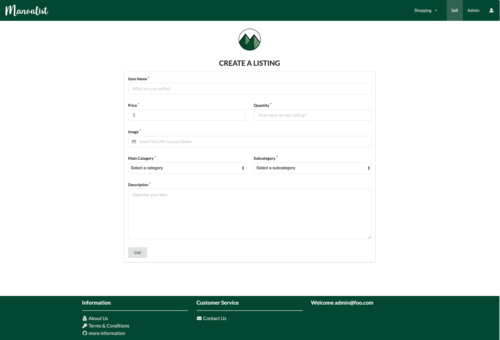
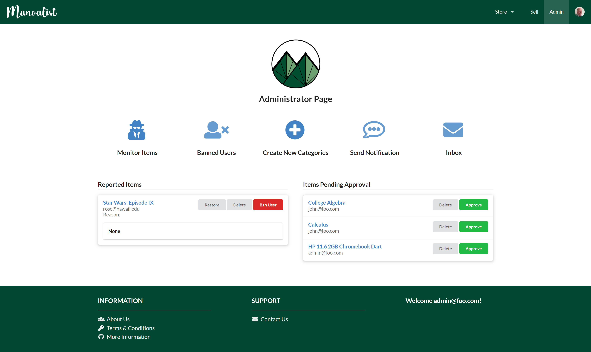
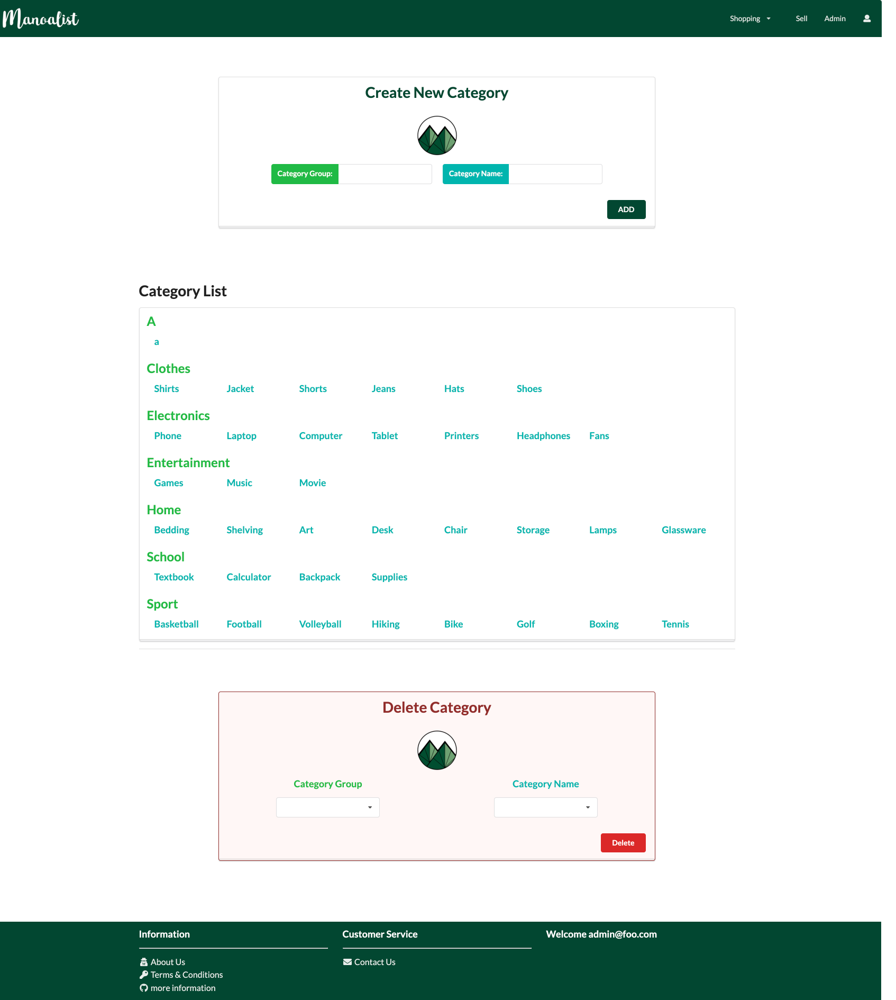

# TABLE OF CONTENTS
***
* [OVERVIEW](#overview)
* [THE TEAM](#the-team)
* [PROGRESS + DEVELOPMENT](#progress--development)
* [USER GUIDE](#user-guide)
* [DEVELOPER GUIDE](#developer-guide)
* [COMMUNITY FEEDBACK](#community-feedback)


# OVERVIEW
***
An application for UHM students to facilitate buying and selling of student-related goods and service. Users can post valid information about their products on the platform, and the products will be displayed by searching their key words (label). It will be similar to the existing website "Craigslist" with added functionality. Our goal is to work closely as a team and develop a website that is both functional and aesthetic.

Features: 
- Ensure only UH students are allowed access
- Log in to view/post items for sale
- Rate sellers after purchase
- "Like" items to view later


# THE TEAM
***
Five ICS students at the University of Hawaii at Manoa.  
Check out our portfolios below! 
* [Craig Opie](https://craigopie.github.io/)
* [Weirong He](https://heweiron.github.io/)
* [Tianhui Zhou](https://tianhuizhou.github.io/)
* [Edwin Zheng](https://edwin-zheng.github.io/)
* [Kyra Ikeda](https://kyraikeda.github.io/)


# PROGRESS + DEVELOPMENT
***
Running deployment on Galaxy: <a href="http://manoalist.meteorapp.com/#/">Manoalist Website</a>

Track the team's progress via Milestones:
* <a href="https://github.com/manoalist/manoalist/projects/1">M1</a>
* <a href="https://github.com/manoalist/manoalist/projects/3">M2</a>
* <a href="https://github.com/manoalist/manoalist/projects/4">M3</a>


# USER GUIDE
***
### Landing Page

The first page seen when accessing the site. Provides a brief introduction to how Manoalist works. Users can sign in/up. 

<a href="http://mymanoalist520.meteorapp.com/#/">Landing page</a>



### Sign Up

If you do not have an account, you can click sign up to register:

<a href="http://mymanoalist520.meteorapp.com/#/signup">Sign up page</a>



### Sign In

You can click log in to access your account:

<a href="http://mymanoalist520.meteorapp.com/#/signin">Sign in page</a>



### Home

After logging in, you will see the home page for you to start shopping. You can search for items or use "shopping" dropdown to see items on each category. You can also see what is new on the list and what are the most popular items. 

<a href="http://mymanoalist520.meteorapp.com/#/home">Home page</a>



### List Items

See what items are available on the site.

<a href="http://mymanoalist520.meteorapp.com/#/list">List item page</a>


### Item Page

See details about an individual item.



### Profile Page

Users can see their own profile page to check items they sell, bought and the rating from other users.


### Add Item Page

Users can post their items for sale to the list.



### Admin Home Page(Admin)

Administrator has their home page that allows them to create new category, monitoring items and send notifications. They can also handle the report and new post from users.



### Add Category(Admin) 

Administrator can add new category and delete useless empty category.




# DEVELOPER GUIDE
***
This section provides information to Meteor developers on how to use this code base as a basis for their own development projects and tasks.

### Installation

First, <a href="https://www.meteor.com/install">install Meteor</a>.

Second, go to the <a href="https://github.com/manoalist/manoalist">Manoalist repo</a>, and click the "Clone or download" button to download your new GitHub repo to your local file system. Using GitHub Desktop is a great choice if you use MacOS or Windows.

Fourth, cd into the app/ directory of your local copy of the repo, and install third party libraries with:
```
$ meteor npm install
```

### Running the system

Once the libraries are installed, you can run the application by invoking the "start" script in the package.json file:
```
$ meteor npm run start
```

### Viewing the running app
If all goes well, the application will appear at [http://localhost:3000](http://localhost:3000). You can login using the credentials in settings.development.json, or else register a new account.


# COMMUNITY FEEDBACK
***
Coming soon. Stay tuned!


<br/><br/>

[Back to table of contents](#table-of-contents)
