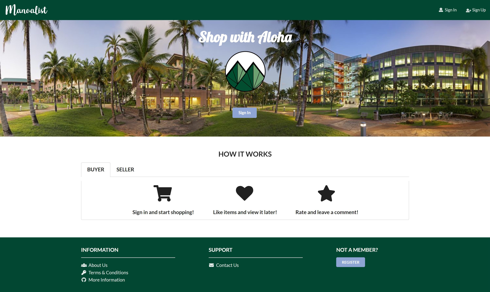

# TABLE OF CONTENTS
***
* [OVERVIEW](#overview)
* [THE TEAM](#the-team)
* [PROGRESS + DEVELOPMENT](#progress--development)
* [USER INTERFACE](#user-interface)

# OVERVIEW
***
An application for UHM students to facilitate buying and selling of student-related goods and service. Users can post valid information about their products on the platform, and the products will be displayed by searching their key words (label). It will be similar to the existing website "Craigslist" with added functionality. Our goal is to work closely as a team and develop a website that is both functional and aesthetic.

Features: 
- Ensure only UH students are allowed access
- Log in to view/post items for sale
- Rate sellers after purchase
- "Like" items to view later

# THE TEAM
***
Five ICS students at the University of Hawaii at Manoa.  
Check out our portfolios below! 
* [Craig Opie](https://craigopie.github.io/)
* [Weirong He](https://heweiron.github.io/)
* [Tianhui Zhou](https://tianhuizhou.github.io/)
* [Edwin Zheng](https://edwin-zheng.github.io/)
* [Kyra Ikeda](https://kyraikeda.github.io/)

# PROGRESS + DEVELOPMENT
***
Running deployment on Galaxy: <a href="http://mymanoalist.meteorapp.com/#/">Manoalist Website</a>

Track the team's progress via Milestones:
* <a href="https://github.com/manoalist/manoalist/projects/1">M1</a>
* <a href="https://github.com/manoalist/manoalist/projects/3">M2</a>
* <a href="https://github.com/manoalist/manoalist/projects/4">M3</a>

# USER INTERFACE
***
### Landing Page

The first page seen when accessing the site. Provides a brief introduction to how Manoalist works. Users can sign in/up 

<a href="http://mymanoalist520.meteorapp.com/#/">Landing page</a>

### Sign Up

If you do not have an account, you can click sign up to register:

<a href="http://mymanoalist520.meteorapp.com/#/signup">Sign up page</a>

### Sign In

You can click log in to access your account:

<a href="http://mymanoalist520.meteorapp.com/#/signin">Sign in page</a>

### Home

After logging in, you will see the home page for you to start shopping. You can search for items or use "shopping" dropdown to see items on each category. You can also see what is new on the list and what are the most popular items. 

<a href="http://mymanoalist520.meteorapp.com/#/home">Home page</a>

### List Items

See what items are available on the site.

<a href="http://mymanoalist520.meteorapp.com/#/list">List item page</a>

  

[Back to table of contents](#table-of-contents)
