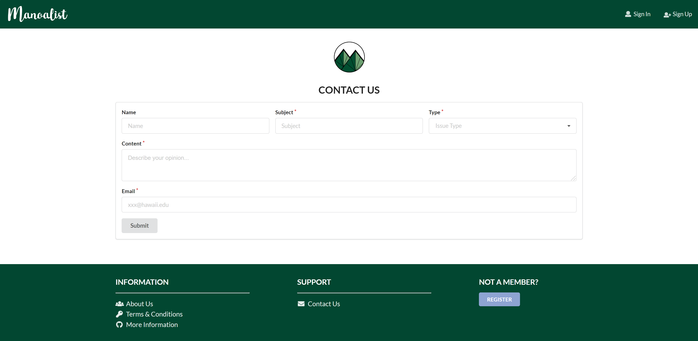

# TABLE OF CONTENTS
***
* [OVERVIEW](#overview)
* [THE TEAM](#the-team)
* [PROGRESS + DEVELOPMENT](#progress--development)
* [USER GUIDE](#user-guide)
* [DEVELOPER GUIDE](#developer-guide)
* [COMMUNITY FEEDBACK](#community-feedback)

<br/>

# OVERVIEW
***
An application for UHM students to facilitate buying and selling of student-related goods and service. Users can post valid information about their products on the platform, and the products will be displayed by searching their key words (label). It will be similar to the existing website "Craigslist" with added functionality. Our goal is to work closely as a team and develop a website that is both functional and aesthetic.

Features: 
- Ensure only UH students are allowed access
- Log in to view/post items for sale
- Rate sellers after purchase
- "Like" items to view later

<br/>

# THE TEAM
***
Five ICS students at the University of Hawaii at Manoa.  
Check out our portfolios below! 
* [Craig Opie](https://craigopie.github.io/)
* [Weirong He](https://heweiron.github.io/)
* [Tianhui Zhou](https://tianhuizhou.github.io/)
* [Edwin Zheng](https://edwin-zheng.github.io/)
* [Kyra Ikeda](https://kyraikeda.github.io/)

<br/>

# PROGRESS + DEVELOPMENT
***
Running deployment on Galaxy: <a href="http://manoalist.meteorapp.com/#/">Manoalist Website</a>

Track the team's progress via Milestones:
* <a href="https://github.com/manoalist/manoalist/projects/1">M1</a>
* <a href="https://github.com/manoalist/manoalist/projects/3">M2</a>
* <a href="https://github.com/manoalist/manoalist/projects/4">M3</a>

<br/>

# USER GUIDE
***
### Landing Page

The first page seen when accessing the site. Provides a brief introduction to how Manoalist works. Users can sign in/up. 

<a href="http://mymanoalist520.meteorapp.com/#/">Landing page</a>


### Sign Up

If you do not have an account, you can click sign up to register:

<a href="http://mymanoalist520.meteorapp.com/#/signup">Sign up page</a>


### Sign In

You can click log in to access your account:

<a href="http://mymanoalist520.meteorapp.com/#/signin">Sign in page</a>


### Home

After logging in, you will see the home page for you to start shopping. You can search for items or use "shopping" dropdown to see items on each category. You can also see what is new on the list and what are the most popular items. 

<a href="http://mymanoalist520.meteorapp.com/#/home">Home page</a>


### List Items

See what items are available on the site. Users are able to sort items by date, price, quantity, and popularity.

<a href="http://mymanoalist520.meteorapp.com/#/list">List item page</a>


### Item Page

See details about an individual item. Users are able to like and report items on this page. They can also contact the seller directly by hitting the Email button. Sellers' ratings/reviews are displayed below the item. Only owners are able to see the Sold and Edit buttons. Only admins can see the Ban User and Delete buttons. 


### Profile

Users can see their own profile page to check on their items for sale, things they bought, and ratings/comments from other users.


### Create a Listing Page

Users can create listings for items they want to sell by filling out the form. 


### Admin Page 

All administrators have their own home page that allows them to monitoring items, look at banned users, create/delete categories, send notifications, and look at their inbox. They can also handle reported items and new listings from users.


### Likes Page

Displays all items that a user likes. Accessed through a dropdown menu by clicking the user's avatar at the top right.


### Inbox Page

See messages from other users about transactions. Accessed through a dropdown menu by clicking the user's avatar at the top right.


### Security Page

Allows users to change their password if desired. Accessed through a dropdown menu by clicking the user's avatar at the top right.


### Contact Us

Users can fill out a form to give feedback/ask questions to administrators.

'

### Terms of Service

Full page detailing the terms and conditions for using Manoalist.


<br/>

# DEVELOPER GUIDE
***
This section provides information to Meteor developers on how to use this code base as a basis for their own development projects and tasks.

### Installation

First, <a href="https://www.meteor.com/install">install Meteor</a>.

Second, go to the <a href="https://github.com/manoalist/manoalist">Manoalist repo</a>, and click the "Clone or download" button to download your new GitHub repo to your local file system. Using GitHub Desktop is a great choice if you use MacOS or Windows.

Fourth, cd into the app/ directory of your local copy of the repo, and install third party libraries with:
```
$ meteor npm install
```

### Running the system

Once the libraries are installed, you can run the application by invoking the "start" script in the package.json file:
```
$ meteor npm run start
```

### Viewing the running app
If all goes well, the application will appear at [http://localhost:3000](http://localhost:3000). You can login using the credentials in settings.development.json, or else register a new account.

<br/>

# COMMUNITY FEEDBACK
***
jwells2@hawaii.edu – Love It!<br/>
This site is fabulous! I love the layout. It is easier to use and visual appealing. I think more search categories are needed but I'm sure once more products are added that will expand searchable items.  Also, it needs more clothing for women.
- Thank you for your feedback jwells2.  We will continue to push towards updating our products and categories to be more specific so searching becomes more efficient.  We will certainly work on adding female clothing items as well.  Mahalo!


irodrigu@hawaii.edu – Feedback<br/>
Good site. Easy to use. I was able to post an item to sell easily!
- Mahalo, unfortunately posting pillows that costed $10,000,000 was contrary to the purpose of our site and you have been banned.  Thank you for your review though!


baghdady@hawaii.edu – Review<br/>
Overall a very nice site. I would like to be able to see "All Items" directly from clicking on the "Store" tab at the top right, rather than having to select a category and then click on "All Items" from the top of the resulting page. (This would enable clicking on the "Store" tab to have the same result as clicking on "Monitor Items" from the Administrator Page.) Also, "Banned Users" is misspelled "Baned users" on the Administrator Page. Otherwise, very nice work!
- Mahalo for the very thorough evaluation and we will implement the shopping link in the header and correct the spelling during our next development release.  


lyoneshi@hawaii.edu – Feedback<br/>
Note that this site is only for UHM affiliated users on home page. That isn't clear until you look under "More Information." Is it possible to have multiple sellers under the same item listing?
- Thank you for taking the time to assess our site!  We agree that the home page could contain more details about how the site is operated and limited to UH members.  Yes, it is possible to have people post multiple items under the same title and category.  We deconflict item names using item IDs on the backend of our site. Mahalo!


zhu@hawaii.edu – Feedback<br/>
I looked at your website and in summary, manoalist looks like a craigslist specific to Manoa.  I tried posting an item for sale and browsed the other items for sale.  I voted on an item too.  Everything was functional.  I’m curious if posting is limited to people in a certain radius of Manoa?  And, why allow voting for posted items?
- Great evaluation!  Yes, manoalist is meant to be just like craigslist but specific to Manoa members.  Unfortunately we do not have a geographic limitation to posting items for sale or buying.  This would be a great addition for future implementations!  As for voting for posted items; we offer ratings for buyers and sellers, and adding items to a watchlist/hearted.  This also allows us to track popular items based on how many people have hearted the item.  We also implemented an item request, like craigslist.  Maybe that is what you are talking about. Mahalo!


<br/><br/>

[Back to table of contents](#table-of-contents)
